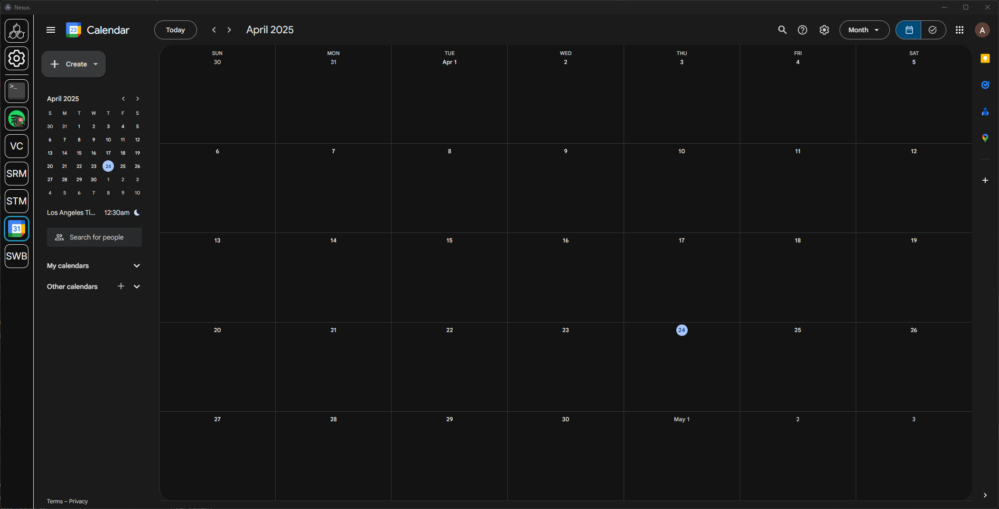

# Nexus: Google Calendar

A Google Calendar module for [Nexus](https://github.com/aarontburn/nexus-core) - perfect for those that have Google Calendar open all the time.

## Installation
1. Download the latest release `.zip`. 
2. In Nexus, navigate to **Settings** > **Import Module**
3. Select the downloaded `.zip` file to install.

## Features
- Simply just Google Calendar.